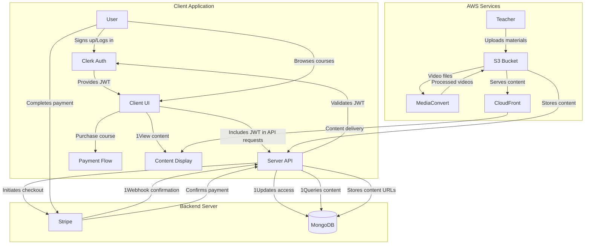

# Learning Management System (LMS) 📚

<div align="center">
  
  
  
  
  
  
</div>

<div align="center">
  <p><em>A modern, full-featured learning management system built with cutting-edge web technologies. Empower educators and learners with an intuitive platform for creating, managing, and consuming educational content.</em></p>
</div>

---

## ✨ Features

<table>
  <tr>
    <td>📝 <b>Course Management</b></td>
    <td>Create, edit, and organize courses with rich content</td>
  </tr>
  <tr>
    <td>👨‍🏫 <b>Teacher Dashboard</b></td>
    <td>Comprehensive tools for educators to manage their content</td>
  </tr>
  <tr>
    <td>👨‍🎓 <b>Student Portal</b></td>
    <td>Intuitive learning experience with progress tracking</td>
  </tr>
  <tr>
    <td>💰 <b>Payment Integration</b></td>
    <td>Secure payment processing for premium courses via Stripe</td>
  </tr>
  <tr>
    <td>🔐 <b>Authentication</b></td>
    <td>Secure user authentication with Clerk</td>
  </tr>
  <tr>
    <td>☁️ <b>Cloud Storage</b></td>
    <td>AWS S3 for course materials and video content</td>
  </tr>
  <tr>
    <td>🎬 <b>Video Processing</b></td>
    <td>AWS MediaConvert for video transcoding</td>
  </tr>
  <tr>
    <td>📱 <b>Responsive Design</b></td>
    <td>Optimized for all devices and screen sizes</td>
  </tr>
</table>

---

## 🏗️ Complete Architecture



<details open>
<summary><b>Authentication Flow</b></summary>
<br>

1. User signs up/logs in via Clerk
2. Clerk provides JWT to client
3. Client includes JWT in API requests to Express server
4. Server validates JWT with Clerk before processing requests
</details>

<details open>
<summary><b>Payment Flow</b></summary>
<br>

1. User selects premium course for purchase
2. Client initiates Stripe checkout session via server
3. User completes payment on Stripe checkout page
4. Stripe sends webhook to server confirming payment
5. Server updates user's course access permissions
</details>

<details open>
<summary><b>Content Delivery Flow</b></summary>
<br>

1. Teacher uploads course materials to AWS S3
2. Video files are sent to AWS MediaConvert for transcoding
3. Processed videos are stored in S3 and served via CloudFront
4. Content URLs are stored in MongoDB and served to authorized users
</details>

---

## 🛠️ Tech Stack

<details>
<summary><b>Frontend</b></summary>
<br>

- **Next.js** - React framework with SSR/SSG capabilities
- **React** - UI component library
- **TypeScript** - Type-safe JavaScript
- **Tailwind CSS** - Utility-first CSS framework
- **Clerk** - Authentication and user management
- **Radix UI** - Accessible UI components
- **Redux Toolkit** - State management
</details>

<details>
<summary><b>Backend</b></summary>
<br>

- **Express.js** - Node.js web framework
- **TypeScript** - Type-safe JavaScript
- **Mongoose** - MongoDB object modeling
- **MongoDB** - NoSQL database
</details>

<details>
<summary><b>Third-Party Services</b></summary>
<br>

- **Clerk** - Authentication and user management
- **Stripe** - Payment processing
- **AWS S3** - Object storage for course materials
- **AWS MediaConvert** - Video processing
- **AWS CloudFront** - Content delivery network
</details>

---

## 🚀 Getting Started

### Prerequisites

- Node.js 18+ and npm/yarn/bun
- MongoDB instance
- AWS account with S3 and MediaConvert access
- Stripe account
- Clerk account

### Installation

1. Clone the repository

   ```bash
   git clone https://github.com/your-username/lms-project.git
   cd lms-project
   ```

2. Set up the client

   ```bash
   cd client
   npm install
   ```

3. Set up the server

   ```bash
   cd ../server
   npm install
   ```

4. Configure environment variables

   <details>
   <summary><b>For client (.env.local)</b></summary>

   | Variable                            | Value                                                                                                       | Description                                 |
   | ----------------------------------- | ----------------------------------------------------------------------------------------------------------- | ------------------------------------------- |
   | `NEXT_PUBLIC_API_BASE_URL`          | http://localhost:8001/api                                                                                   | Base URL for API endpoints                  |
   | `NEXT_PUBLIC_LOCAL_URL`             | localhost:3000                                                                                              | Base URL for client application             |
   | `NEXT_PUBLIC_CLERK_PUBLISHABLE_KEY` | your_clerk_publishable_key                                                    | Clerk public key for authentication         |
   | `CLERK_SECRET_KEY`                  | your_clerk_secret_key                                                          | Clerk secret key for server-side operations |
   | `NEXT_PUBLIC_STRIPE_PUBLIC_KEY`     | your_stripe_public_key | Stripe publishable key for payments         |
   | `NEXT_PUBLIC_STRIPE_REDIRECT_URL`   | http://localhost:3000/checkout?step=3                                                                       | Redirect URL after successful payment       |

   </details>

   <details>
   <summary><b>For server (.env)</b></summary>

   | Variable                | Value                                                                                                                    | Description                              |
   | ----------------------- | ------------------------------------------------------------------------------------------------------------------------ | ---------------------------------------- |
   | `PORT`                  | 8001                                                                                                                     | Server port number                       |
   | `NODE_ENV`              | development                                                                                                              | Environment mode                         |
   | `MONGODB_URI`           | your_mongodb_connection_string | MongoDB database connection URL          |
   | `CLERK_PUBLISHABLE_KEY` | your_clerk_publishable_key                                                                 | Clerk public key for authentication      |
   | `CLERK_SECRET_KEY`      | your_clerk_secret_key                                                                       | Clerk secret key for server operations   |
   | `STRIPE_SECRET_KEY`     | your_stripe_secret_key              | Stripe secret key for payment processing |
   | `AWS_Region`            | us-east-1                                                                                                                | AWS region for services                  |
   | `S3_BUCKET_NAME`        | your_bucket_name                                                                                                            | Name of S3 bucket for content storage    |
   | `CLOUDFRONT_DOMAIN`     | your_cloudfront_domain                                                                                    | CloudFront domain for content delivery   |

   </details>

5. Start development servers

   ```bash
   # For client
   npm run dev

   # For server (in a separate terminal)
   npm run dev
   ```

6. Access the application
   - Open [http://localhost:3000](http://localhost:3000) in your browser.

---

## 📝 Available Scripts

### Client

|     Command     | Description              |
| :-------------: | :----------------------- |
|  `npm run dev`  | Start development server |
| `npm run build` | Build for production     |
| `npm run start` | Run production server    |
| `npm run lint`  | Run ESLint               |

### Server

|     Command     | Description                              |
| :-------------: | :--------------------------------------- |
|  `npm run dev`  | Start development server with hot reload |
| `npm run build` | Compile TypeScript files                 |
| `npm run start` | Start production server                  |

---

## 🔒 Authentication

This project uses Clerk for authentication. Set up your Clerk account and configure the necessary environment variables:

1. Create a Clerk application in the Clerk dashboard
2. Configure the JWT settings to match your domain
3. Set up OAuth providers if needed (Google, GitHub, etc.)
4. Add the Clerk publishable key to the client env vars
5. Add the Clerk secret key to the server env vars

---

## 💳 Payments

Stripe integration handles all payment processing:

1. Create a Stripe account and get your API keys
2. Set up products and prices in the Stripe dashboard
3. Configure webhook endpoints for payment events
4. Add Stripe keys to both client and server env vars

---

## ☁️ AWS Integration

AWS services power content storage and processing:

1. Create an AWS account and IAM user with appropriate permissions
2. Set up an S3 bucket for course content storage
3. Configure MediaConvert for video processing
4. Optional: Set up CloudFront for content delivery
5. Add AWS credentials to server env vars

---

## 🌐 Deployment

### Client

The frontend is deployed on Vercel. [Visit](https://learning-management-system-one-theta.vercel.app/)

### Server

The backend is deployed using Docker, AWS Lambda, AWS ECR, and AWS cloudfront.

---

## 📚 Learn More

<div align="center">

[](https://nextjs.org/docs)
[](https://expressjs.com/)
[](https://tailwindcss.com/docs)

[](https://docs.mongodb.com/)
[](https://stripe.com/docs)
[](https://docs.aws.amazon.com/)

</div>

---

## 📄 License

This project is licensed under the MIT License - see the [LICENSE](LICENSE) file for details.

<div align="center">
  <p>Built with ❤️ by <a href="https://github.com/anubhabx">anubhabx</a></p>
</div>
